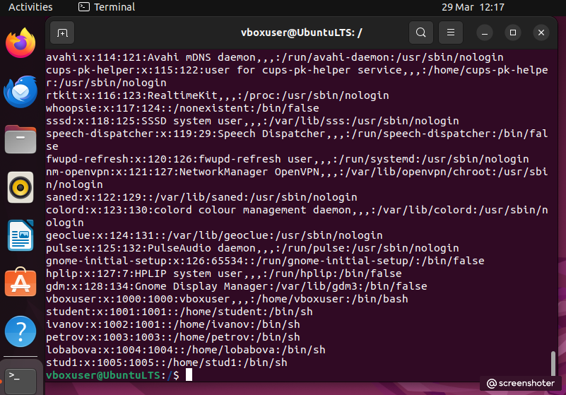
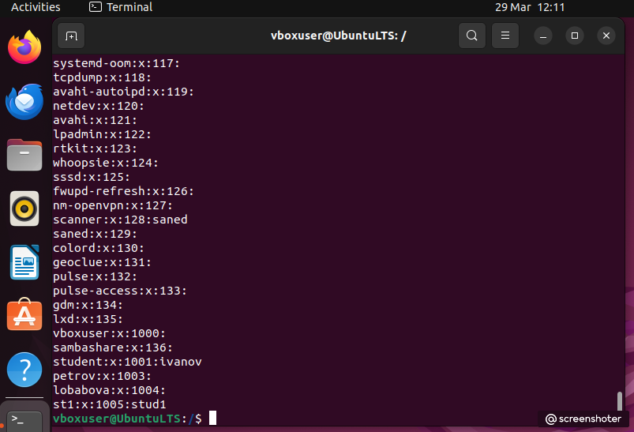
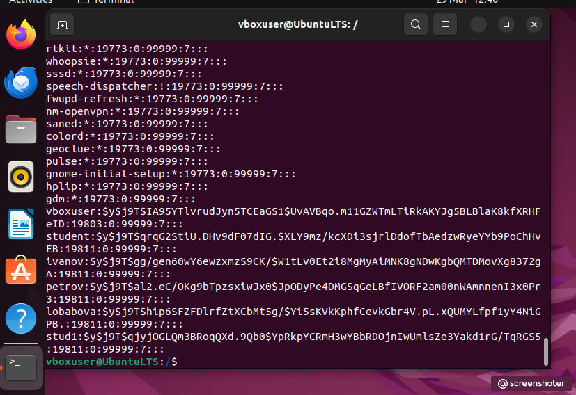
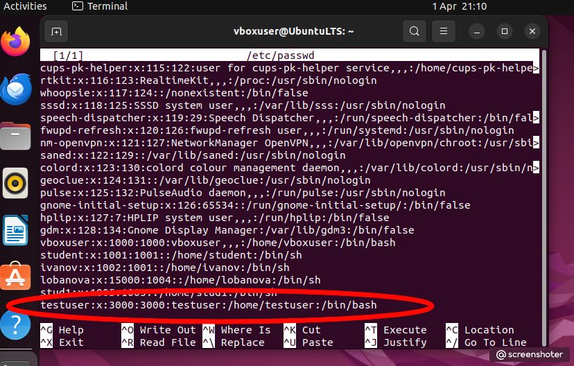
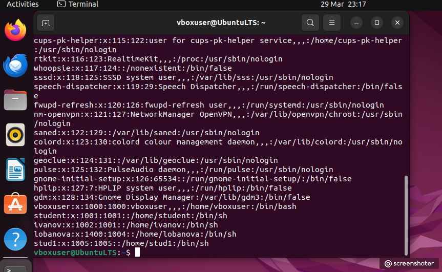
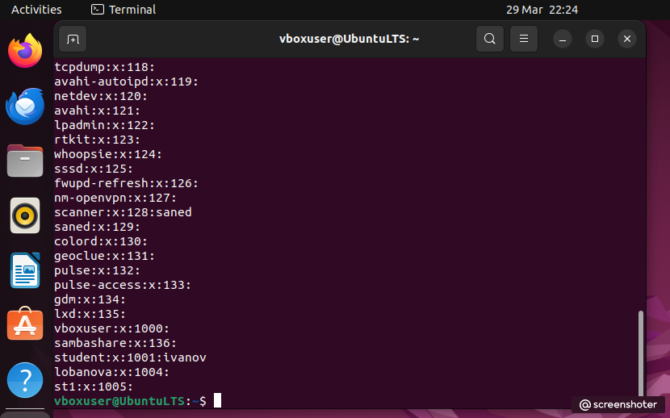
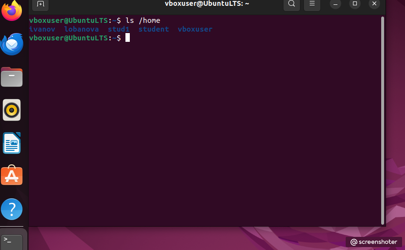

# Домашнее задание. Управление пользователями Linux
1. Записи о созданных пользователях

 
Записи о созданных группах

Записи о зашифрованных паролях

2. Создание учетной записи вручную

3. Удаление учетной записи пользователя petrov

## Контрольные вопросы
### 1. Опишите основные команды создания и редактирования пользователей.

**Useradd** Добавление пользователя осуществляется при помощи команды **useradd**. Для вызова команды необходимы права суперпользователя.

-b Базовый каталог. Это каталог, в котором будет создана домашняя папка пользователя.
По умолчанию /home

-с Комментарий. В нем может быть любой текст.

-d Имя домашнего каталога. По умолчанию название совпадает с именем создаваемого пользователя.

-e Дата, после которой пользователь будет отключен. Задается в формате ГГГГ-ММ-ДД. По
умолчанию отключено.

-f Количество дней, которые должны пройти после устаревания пароля до блокировки
пользователя, если пароль не будет изменен (период неактивности). Если значение рав-
но 0, то запись блокируется сразу после устаревания пароля, при -1 - не блокируется. По умолчанию -1.

-g Первичная группа пользователя. Можно указывать как GID, так и имя группы. Если параметр не задан будет создана новая группа название которой совпадает с именем пользователя.

-G Список вторичных групп в которых будет находится создаваемый пользователь

-k Каталог шаблонов. Файлы и папки из этого каталога будут помещены в домашнюю пап-
ку пользователя. По умолчанию /etc/skel.

-m Ключ, указывающий, что необходимо создать домашнюю папку. По умолчанию домашняя папка не создается.

-p Зашифрованный пароль пользователя. По умолчанию пароль не задается, но учетная пользователь будет заблокирован до установки пароля

-s Оболочка, используемая пользователем. По умолчанию /bin/sh.

-u Вручную задать UID пользователю.

**Usermod** Изменение параметров пользователя происходит с помощью утилиты **usermod**.
Команда usermod использует те же опции, что и команда
useradd.

**Passwd** Изменить пароль пользователю можно при помощи утилиты **passwd**. Для ее выполнения необходимы права
суперпользователя.

Команда passwd может использоваться и обычным пользователем для смены собственного пароля. Для этого пользователю надо ввести passwd и ввести старый и новый пароли.

-d Удалить пароль пользователя. После этого пароль станет пустым, и пользователь сможет войти в систему без ввода пароля.

-e Сделать пароль устаревшим. Это заставит пользователя изменить пароль при следующем входе в систему.

-i Заблокировать учетную запись пользователя по прошествии указанного количества дней после устаревания пароля.

-n Минимальное количество дней между сменами пароля.

-x Максимальное количество дней, после которого необходимо обязательно сме-
нить пароль.

-l Заблокировать учетную запись пользователя.

-u Разблокировать учетную запись пользователя.

**Userdel** Для удаления пользователя используется команда userdel.
Для её использования необходимы права суперпользователя.
Команда userdel имеет два основных ключа:

-f Принудительно удалить пользователя, даже если он сейчас работает в системе.

-r Удалить домашний каталог пользователя.

### 2. Опишите основные команды создания и редактирования групп.

**Groupadd** Команда groupadd создаёт новую группу согласно указанным значениям командной строки и системным значениям по умолчанию. Для выполнения команды необходимы права суперпользователя. Основные ключи:

-g Установить собственный GID.

-p Пароль группы.

-r Создать системную группу.

**Groupmod** Изменение параметров группы. Сменить название группы, ее идентификационный номер
(GID) или пароль можно при помощи команды groupmod. Для выполнения команды необходимы права суперпользователя.
Опции команды groupmod:

-g Установить другой GID.

-n Новое имя группы.

-p Изменить пароль группы.

**Groupdel** Удаление группы производится с помощью команды groupdel. Для выполнения команды необходимы права суперпользователя.
Команда groupdel не имеет параметров.

### 3. Опишите формат файла /etc/passwd

**passwd (etc/passwd)** – содержит информацию о пользователях. 

У файлов /etc/passwd следующие права доступа: чтение и запись для root, для остальных – только чтение.

Файл /etc/passwd может читать любой пользователь

### 4. Опишите формат файла /etc/shadow

**shadow (etc/shadow)** – в этом файле хранятся "теневые пароли", информация о паролях пользователей в зашифрованном виде.

Файл /etc/shadow может читать только root.

### 5. Опишите формат файла /etc/group.

**group (etc/group)** – информация о группах. У файлов /etc/group следующие права доступа: чтение и запись для root, для остальных – только чтение.

### 6. Опишите формат файла /etc/gshadow

**gshadow (etc/gshadow)** – то же самое что и shadow, только для паролей групп.

### 7. Что содержится в каталоге /etc/skel?

/etc/skel – каталог с файлами по умолчанию, которые копируются в домашний каталог каждого пользователя при его создании.

### 8. Опишите процесс регистрации пользователя вручную, путем редактирования конфигурационных файлов.

Чтобы вручную добавить нового пользователя в систему в файл /etc/passwd, добавьте следующую строку:

testuser:x:3000:3000:test user:/home/testuser:/bin/bash

Добавлен пользователь «testuser» с идентификатором 3000.
Пользователь добавлен в группу с таким же идентификатором, которая еще не создана. У пользователя установлен комментарий, гласящий «test user», домашний каталог
установлен как "/home/testuser", а командная оболочка – как "/bin/bash". Cохраните файл.

### 9. Для чего предназначены файлы /etc/profile и $HOME/.profile

Информация файла профиля **/etc/profile** используется при входе в систему каждого пользователя. Этот файл обычно содержит:
- глобальные или локальные переменные среды;
- информацию о пути к файлам в переменной PATH;
- параметры терминала;
- меры безопасности;
- советы дня или сведения о причинах отказа.

После выполнения /etc/profile пользователь попадает в свой домашний каталог **$HOME**. В этом каталоге хранится вся личная информация пользователя. Если в $HOME имеется файл .profile, система использует его в качестве исходного файла. Установки /etc/profile могут быть переопределены при добавлении в файл .profile нового элемента с другим
значением либо при выполнении команды unset. Настройка файла .profile остается в распоряжении пользователя.

